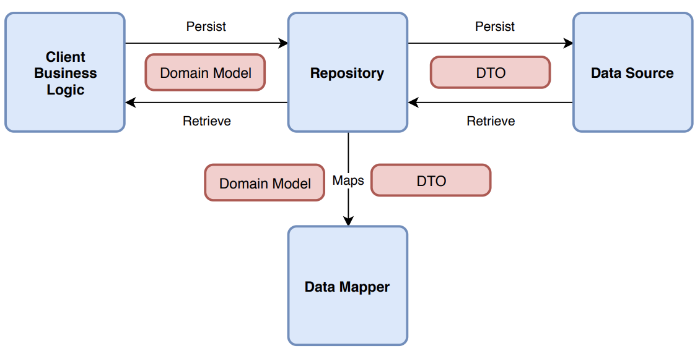

# The Movie DB  

This repository contains The Movie DB Android application which is done as [Aperto (IBM iX) Android Interview Challenge](TASK.md).

 

## Functionality

The app is composed of 2 screens:

### Trending Activity

It allows you to see trending movies and TV shows in two separate rows. Network results are being loaded on UI.

### Details Activity

It shows more detail about the selected movie or TV show.

## Building

You can clone and open the project in Android studio and press run!

## Testing

The project uses local unit tests that run on your computer. To run those tests and generate a coverage report, you can run:

	./gradlew jacocoReport

***NOTE:*** You can find the tests report in `app/build/reports/jacoco/jacocoReport/html/index.html` 

## Technical details

The Application implemented and structured based on **Clean Architecture** and **SOLID principles** best practices and the presentation layer is implemented based on the **MVP** pattern.

The **Data** layer contains **Network Client** implemented by *Retrofit* library to get access to remote data on [themoviedb.org](https://developers.themoviedb.org/4/getting-started/authorization). It also uses *Retrofit* caching feature to save some results to load in case of no internet connection.

The **Domain** layer consists of a **Repository** that allows access to the Data layer. It also uses *Kotlin Coroutines* **IO** and **Main** *dispatchers* to execute long-running tasks in the background and reflect the result on UI. There is also a **Test** *dispatcher* that executes tasks immediately on the same unit test thread.

The **View** layer is done with two Activities and multiple Fragments which uses the main contract interfaces for implementing the *view* and *presenter* to respond to user interactions.

The **Koin** library does the *dependency injections* in the whole app.

[**GitHub Actions CI service**](https://github.com/mohsenoid/TheMovieDb/actions) is running the repo tests and build Gradle tasks and **jacoco** plugin generates and submit the code coverage reports to [**codecov.io**](https://codecov.io/gh/mohsenoid/TheMovieDb).

There are some unit tests using **Mockito** and **Kluent** and some Android tests using **Robolectric**.

## Libraries

- **Timber** logger library made by [Jake Wharton](https://github.com/JakeWharton/timber)
- **Picasso** image downloading and caching library made by [square](https://github.com/square/picasso)
- **Retrofit** and **OkHttp** API libraries made by [square](https://github.com/square/retrofit)
- **Kotlin Serialization** plugin made by [jetbrains](https://github.com/Kotlin/kotlinx.serialization)
- **Koin** dependency injector library made by [InsertKoinIO](https://github.com/InsertKoinIO/)
- **Kluent** assertions library made by [MarkusAmshove](https://github.com/MarkusAmshove/Kluent)
